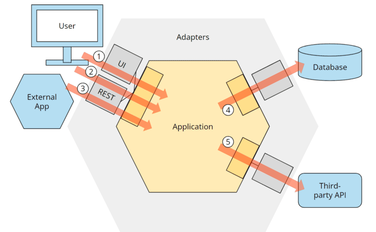
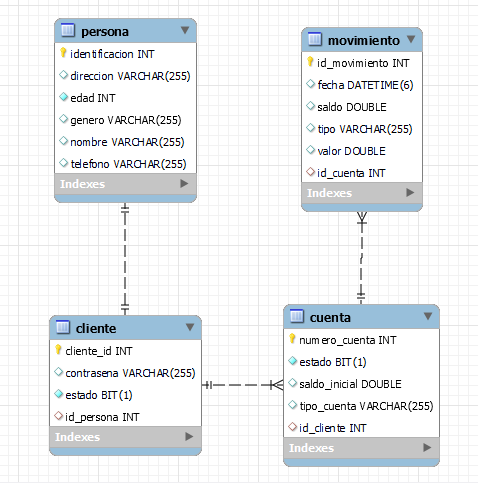

# Demo Bank
by Wilson Paul Rojas C.

## Descripción General
Este proyecto permite administrar registros de entidades clave, incluyendo Clientes, Cuentas y Movimientos, a través de una API. Proporciona endpoints para realizar operaciones de creación, edición y eliminación de registros en estas entidades. Los tres endpoints principales son /cuentas, /clientes y /movimientos, que le permiten gestionar de manera eficiente la información relacionada con estos componentes.


## Arquitectura
Este proyecto se desarrolló siguiendo el principio de arquitectura hexagonal (también conocido como puertos y adaptadores). La arquitectura hexagonal promueve una separación clara entre la lógica empresarial y los detalles técnicos, lo que permite una mayor flexibilidad y facilidad de mantenimiento. Los puertos definen interfaces que representan las capacidades del sistema, mientras que los adaptadores implementan estas interfaces y se encargan de la comunicación con elementos externos, como bases de datos o interfaces de usuario. Esta arquitectura fomenta la modularidad, la prueba unitaria y la evolución sencilla del sistema, lo que lo convierte en una elección sólida para proyectos de software de alto rendimiento y mantenibilidad.




## Testing

Se crearon pruebas unitarias de los repositorios, de la capa de servicio y también de pruebas de integración de los endpoints.
El siguiente link redirige directamente al directorio de pruebas:
[Directorio de Pruebas](https://github.com/paulrcam12/demoBank/tree/master/src/test/java/com/example/demobank)


## Iniciar aplicación
### Desplegar contenedor MySQL localmente
Esta aplicación requiere una base de datos MySQL.

Para crear un contenedor de docker mySQL se tienen que ejecutar los siguientes comandos: .

```sh
docker pull mysql
docker run -p 3307:3306 --name mysqlcontainer -e MYSQL_ROOT_PASSWORD=root -e MYSQL_DATABASE=bank -d mysql
```

Para crear la conexión con el contenedor:
```sh
docker network create networkmysql
docker network connect networkmysql mysqlcontainer 
```
Para crear la conexión con el contenedor:
```sh
docker network create networkmysql
docker network connect networkmysql mysqlcontainer 
```

## Crear esquema de datos
La aplicación tiene implementado JPA que nos brinda la ventaja de automáticamente crear el esquema de entidades al iniciar la aplicación, por lo que no tendríamos que ejecutar las sentencias SQL para crear las tablas, sin embargo si fuera el caso, el siguiente link lleva al script:
[BaseDatos.sql](https://github.com/paulrcam12/demoBank/blob/master/BaseDatos.sql)

El modelo entidad relación de la aplicación se puede observar en la imagen:




### Desplegar contenedor Docker
Para crear la conexión con el contenedor de MySQL ejecutamos lo siguiente:
```sh
docker build -t bankimage . 
docker run -p 8090:8080 --name bankimage --net networkmysql -e MYSQL_HOST=mysqlcontainer -e MYSQL_PORT=3306 -e MYSQL_DB_NAME=bank -e MYSQL_USER=root -e MYSQL_PASSWORD=root bankimage
```

Si queremos usar una base de datos local existente usamos este comando:
```sh
docker run -p 8090:8080 --name bankimage --net host -e MYSQL_HOST=host.docker.internal -e MYSQL_PORT=3306 -e MYSQL_DB_NAME=bank -e MYSQL_USER=user -e MYSQL_PASSWORD=password bankimage
```
## Uso con Postman
Puede descargar archivos de tipo JSON para importarlos a Postman y usar los endpoints, hay un archivo por cada endpoint
[/cliente](https://github.com/paulrcam12/demoBank/blob/master/PostmanJSON/Cliente.postman_collection.json)
[/cuenta](https://github.com/paulrcam12/demoBank/blob/master/PostmanJSON/Cuenta.postman_collection.json)
[/movimiento](https://github.com/paulrcam12/demoBank/blob/master/PostmanJSON/Movimiento.postman_collection.json)
[/reporte](https://github.com/paulrcam12/demoBank/blob/master/PostmanJSON/Reporte.postman_collection.json)


